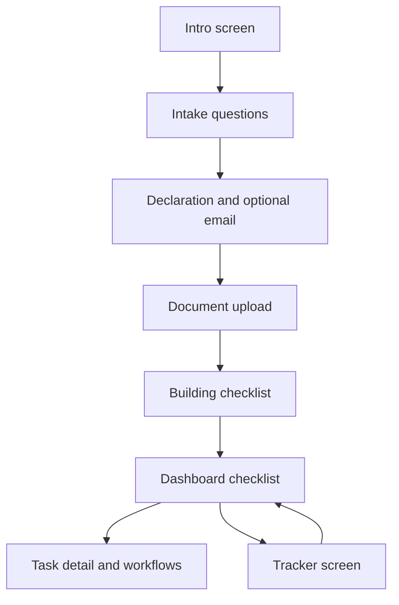

# Passage — Implementation, user flow, and functionality

This document describes the **current** Passage estate guide as implemented in this repository: a single-page web app ([passage-v2.html](passage-v2.html)) plus an optional Node API ([server/](server/)).

---

## 1. Architecture overview

| Layer | Role |
|--------|------|
| **Browser UI** | One HTML file with embedded CSS and JavaScript. No build step required. |
| **Client state** | In-memory objects (`A`, `tasks`, workflows, etc.) with **localStorage** persistence (`passage_estate_v1`). |
| **API server** | Express app that proxies Anthropic’s Messages API and runs a **bank-letter orchestration** pipeline. API keys stay **server-side** only. |

**Information vs knowledge (conceptual)**

- **Information (client):** Intake answers, notes, vault file metadata, tracker entries — the “ground truth” you type or upload. Sent to the server in request bodies when calling AI endpoints.
- **Knowledge (server):** [server/knowledge/banks.json](server/knowledge/banks.json) — curated institution contacts; used by the Search-style step in bank orchestration (no live web crawl in the current build).

---

## 2. User flow (end-to-end)

### Step-by-step

1. **Intro** — User starts the estate guide.
2. **Intake** — Multi-step questionnaire: deceased name, relationship, state, assets, debts, digital accounts, benefits, survivors, **discovery** (extra contexts), will/trust status.
3. **Declaration** — Optional email “save progress” (demo simulation); legal name confirmation to continue.
4. **Upload** — Death certificate and/or bank statement or tax return (optional). Optional **date of death** and **county** fields for deadlines. Files are listed locally (not uploaded to a server in this prototype).
5. **Loading** — Animated steps while the app calls the API to **generate a personalized task list** (or uses fallback tasks if the API fails).
6. **Dashboard** — Tasks grouped by category, urgency (Do first / Soon / Later), progress bar. User can open **Tracker**, select tasks, toggle completion, add **custom tasks**, and use **chat**.
7. **Per-task workflows** — Depends on task type (bank, streaming, employer, SSA, VA, life insurance, generic). Includes **Agent trace** (right column), drafts, privacy checks, and lawyer/CPA cards when relevant.
8. **Resume** — If saved data exists in localStorage, the app can restore and skip straight to the dashboard when continuing from upload with existing tasks.

---

## 3. Frontend implementation

### 3.1 Screens (`id` on `.screen`)

| Screen ID | Purpose |
|-----------|---------|
| `s-intro` | Landing and CTA to begin |
| `s-intake` | Questionnaire (`Qs` array) |
| `s-declare` | Executor declaration + optional email |
| `s-upload` | Document upload + optional death date / county |
| `s-loading` | Checklist generation animation |
| `s-dashboard` | Task list + main panel + agent trace column |
| `s-tracker` | Certificate counts, institution log, deadlines, export |

**Floating chat** — FAB opens a panel; context-aware starters when a task is selected.

### 3.2 Key client behaviors

- **Task generation:** `POST` to `{API_BASE}/v1/messages` with a system prompt that requires a JSON array of tasks; merges with **custom tasks** after each generation.
- **Filtering:** `shouldShow()` hides tasks that do not match intake (e.g. VA tasks if no VA benefits).
- **Probate hint:** `needsProbate()` adjusts probate-related task copy when appropriate.
- **API base:** Default `http://localhost:8787`. Override with `window.PASSAGE_API_BASE` before the main script runs (or inject via a small wrapper page).
- **Bank workflow:** Prefers `POST {API_BASE}/api/orchestrate/bank-draft` (SSE: trace events + draft deltas). On failure, **falls back** to streaming via `/v1/messages` only (`bankStep3DraftDirect`).
- **Persistence:** `savePassageState` / `loadPassageState` / `scheduleSave` — intake, tasks, custom tasks, completion, notes, workflow state, vault file lists, tracker, question index.
- **Trace UI:** `addTrace()` / `renderTrace()` — types include `step`, `action`, `verify`, `warn`, `escalate`.
- **Guardrails (chat):** `GUARDRAIL_PATTERNS` — blocked questions get a fixed redirect and a trace warning.
- **Sensitivity:** `checkSensitivity()` flags full SSN / long account numbers in drafts.

### 3.3 Workflow types (task name heuristics)

| Pattern | Behavior |
|---------|----------|
| Bank / financial | Multi-step: institution → contact card → account details → draft → privacy → send instructions |
| Streaming / subscriptions | Per-service cancel guidance and optional cancellation message |
| Employer / HR | Company → streaming draft → send |
| SSA / VA / Life insurance | Structured sub-cards and/or draft buttons |
| Generic | “Draft letter” with streaming output |
| Probate / attorney keywords | Lawyer referral card + async referral JSON |

---

## 4. Backend implementation

### 4.1 Endpoints ([server/index.js](server/index.js))

| Method | Path | Description |
|--------|------|-------------|
| `GET` | `/health` | JSON `{ ok, service }` |
| `POST` | `/v1/messages` | Proxies to Anthropic with `ANTHROPIC_API_KEY`; streams body through when `stream: true` |
| `POST` | `/api/orchestrate/bank-draft` | Server-Sent Events: orchestrated bank letter with trace lines + streamed draft |

### 4.2 Bank orchestration (logical agents)

The orchestrator is **one pipeline**, not four separate services:

1. **General assistant** — Announces coordination (SSE trace).
2. **Search agent** — Resolves institution from **knowledge** via `findBankContact()` (curated JSON, not open web).
3. **Communication agent** — Streams the bank notification letter via Anthropic.
4. **Verify agent** — Heuristic checks (e.g. deceased name in draft, SSN-like patterns); emits trace lines.

**Guardrails:** `shouldBlockUserMessage()` can block orchestration if extended to pass chat text (body field `lastUserMessage`).

### 4.3 Configuration

- **Env:** `ANTHROPIC_API_KEY` (required), `PORT` (default `8787`).
- See [server/README.md](server/README.md) and [server/.env.example](server/.env.example).

---

## 5. Functionality summary

| Area | What users can do |
|------|-------------------|
| **Onboarding** | Full intake, discovery question, optional death date/county on upload |
| **Journey** | AI-generated checklist, urgency labels, categories, progress, filter irrelevant tasks |
| **Custom tasks** | Add named tasks; persisted and merged after list regeneration |
| **Dependency hints** | Amber hint under tasks when death-certificate task may be needed first |
| **Tracker** | Cert copy counts, institution response rows, deadline hints, print/PDF, clear all data |
| **Letters** | Streaming drafts, redraft, copy, **email-style copy** (To/Subject/body) on bank step, **download .txt** |
| **Ground truth** | Modal before privacy step on bank flow to confirm intake vs draft |
| **Chat** | Context-aware help; guardrails on sensitive prompts |
| **Escalation** | Lawyer/CPA cards with state-based referral JSON when applicable |
| **Save/resume** | localStorage; resume from upload path if tasks + name exist |

---

## 6. Hosting (quick reference)

| Piece | Typical hosting |
|--------|-----------------|
| **Frontend** | Static host (Netlify, Vercel static, Cloudflare Pages, GitHub Pages). Serve `passage-v2.html` or rename to `index.html`. |
| **Backend** | Railway, Render, Fly.io, Cloud Run, etc. Set `ANTHROPIC_API_KEY` and `PORT`. |
| **CORS** | Server uses permissive CORS for development; tighten `origin` to your static URL in production. |
| **Frontend API URL** | Set `window.PASSAGE_API_BASE` to your deployed API HTTPS URL. |

---

## 7. Deferred / V2

See [V2_BACKLOG.md](V2_BACKLOG.md) for features not implemented in this codebase (funeral finder, unclaimed property, sharing, Gmail/DocuSign, etc.).

---

## 8. File map

| Path | Purpose |
|------|---------|
| [passage-v2.html](passage-v2.html) | Full UI + client logic |
| [server/index.js](server/index.js) | Express server, proxy, orchestration |
| [server/knowledge/banks.json](server/knowledge/banks.json) | Institution knowledge base |
| [server/lib/knowledge.js](server/lib/knowledge.js) | `findBankContact` |
| [server/lib/guardrails.js](server/lib/guardrails.js) | Blocked phrase list for server |
| [V2_BACKLOG.md](V2_BACKLOG.md) | Future work list |
